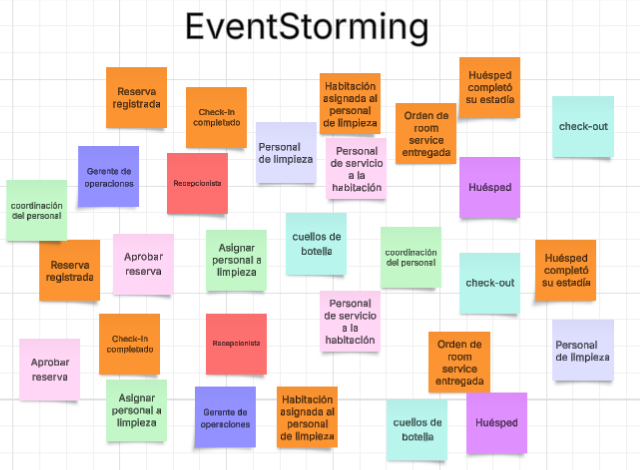

## Capítulo IV: Solution Software Design

### 4.1. Strategic-Level Domain-Driven Design
Para abordar la complejidad de un sistema orientado a la gestión integral de operaciones hoteleras, se aplicó el enfoque de Domain-Driven Design a nivel estratégico. Este enfoque nos permitió identificar los distintos subconjuntos funcionales del sistema o Bounded Contexts que reflejan las áreas clave de negocio de nuestros usuarios objetivos: cadenas hoteleras, hoteles boutique y resorts.

El proceso se desarrolló mediante herramientas colaborativas como Event Storming y el Bounded Context Canvas.
### 4.1.1. EventStorming
Con el objetivo de comprender en profundidad el dominio del problema, se llevó a cabo una sesión de EventStorming. Con esta dinámica se pudieron identificar eventos clave dentro del negocio hotelero, facilitando la visualización de procesos críticos desde la reserva hasta la atención post-estadía del huésped, entre otros puntos de contacto. Esta actividad no solo ayudó a identificar los eventos, sino que también permitió descubrir las interacciones entre ellos y cómo se relacionan con los distintos actores involucrados.

**Objetivo de la sesión**: El objetivo de la sesión fue identificar los eventos clave del dominio del problema, así como los actores involucrados y sus interacciones. A través de esta actividad, se buscó obtener una comprensión profunda del negocio hotelero y sus procesos críticos.
Durante una sesión de aproximadamente 1 hora y 30 minutos, se desarrollaron las siguientes actividades:
1. **Identificación de eventos**: Se identificaron los eventos clave del dominio del problema, como "Reserva de habitación", "Check-in", "Check-out", entre otros. Estos eventos fueron representados en post-its de color naranja, lo que facilitó su visualización y comprensión.
2. **Identificación de actores**: Se identificaron los actores involucrados en el proceso, como "Huésped", "Recepcionista", "Gerente de hotel", entre otros.
3. **Interacciones entre eventos y actores**: Se establecieron las interacciones entre los eventos y los actores, lo que permitió visualizar cómo se relacionan y cómo influyen en el proceso general del negocio hotelero.
4. **Identificación de comandos y agregados**: Se identificaron los comandos y agregados asociados a cada evento, lo que permitió comprender cómo se gestionan los datos y las acciones dentro del sistema.

**Herramienta utilizada:** Para esta sesión se empleó Lucidchart, una herramienta colaborativa que permite crear diagramas y visualizar procesos de manera efectiva. Esta herramienta facilitó la colaboración entre los participantes y permitió documentar de manera clara y concisa los resultados de la sesión.

**Figura 1:**

En esta figura se puede observar el resultado de la sesión de EventStorming, donde el equipo identificó los eventos clave del dominio del problema, los actores involucrados y sus interacciones. 

### 4.1.1.1. Candidate Context Discovery
En esta sección se muestra como se llevó a cabo una sesión de Candidate Context Discovery con el fin de identificar los posibles Bounded Contexts que estructurarán estratégicamente la solución

**Objetivo de la sesión**: La sesión tuvo como finalidad analizar los eventos, comandos y actores identificados previamente para determinar los límites dentro del sistema.

**Técnica utilizada**: Look-For-Pivotal-Events

Se destacaron eventos de negocio que marcan cambios de estado significativos:

“Reserva confirmada” (transición de cliente interesado a huésped)

“Check-in completado” (inicio del proceso operativo interno)

“Check-out completado” (cierre del ciclo de atención)

**Herramienta utilizada**: Para esta sesión también se utilizó Lucidchart, para que de manera colaborativa el equipo pueda crear diagramas y visualizar procesos de manera efectiva.

**Figura 2:**

En esta figura se puede observar el resultado de la sesión de Candidate Context Discovery, donde el equipo utilizó las técnicas  start-with
value, start-with-simple y look-for-pivotal-events.

### 4.1.1.2. Domain Message Flows Modeling
Una vez definidos los Bounded Contexts principales, se procedió a modelar los flujos de colaboración entre ellos mediante la técnica de Domain Storytelling.

**Figura 3:**

Esta figura muestra el flujo de colaboración entre el huésped y el sistema de reservas al momento de realizar una reserva. El proceso inicia con la solicitud del huésped, seguida por la verificación de disponibilidad y la confirmación de la reserva por parte del sistema. Posteriormente, se genera un registro de reserva.

### 4.1.1.3. Bounded Context Canvases

### 4.1.2. Context Mapping

### 4.1.3. Software Architecture

### 4.1.3.1. Software Architecture Context Level Diagrams

### 4.1.3.2. Software Architecture Container Level Diagrams

### 4.1.3.3. Software Architecture Deployment Diagrams

### 4.2. Tactical-Level Domain-Driven Design

### 4.2.1. Bounded Context: <Bounded Context Name>

### 4.2.1.1. Domain Layer

### 4.2.X.2. Interface Layer

### 4.2.X.3. Application Layer

### 4.2.X.4.Infrastructure Layer

### 4.2.X.5.Bounded Context Software Architecture Component Level Diagrams

### 4.2.X.6.Bounded Context Software Architecture Code Level Diagrams

### 4.2.X.6.1.Bounded Context Domain Layer Class Diagrams

### 2.6.x.6.2.Bounded Context Database Design Diagram 

