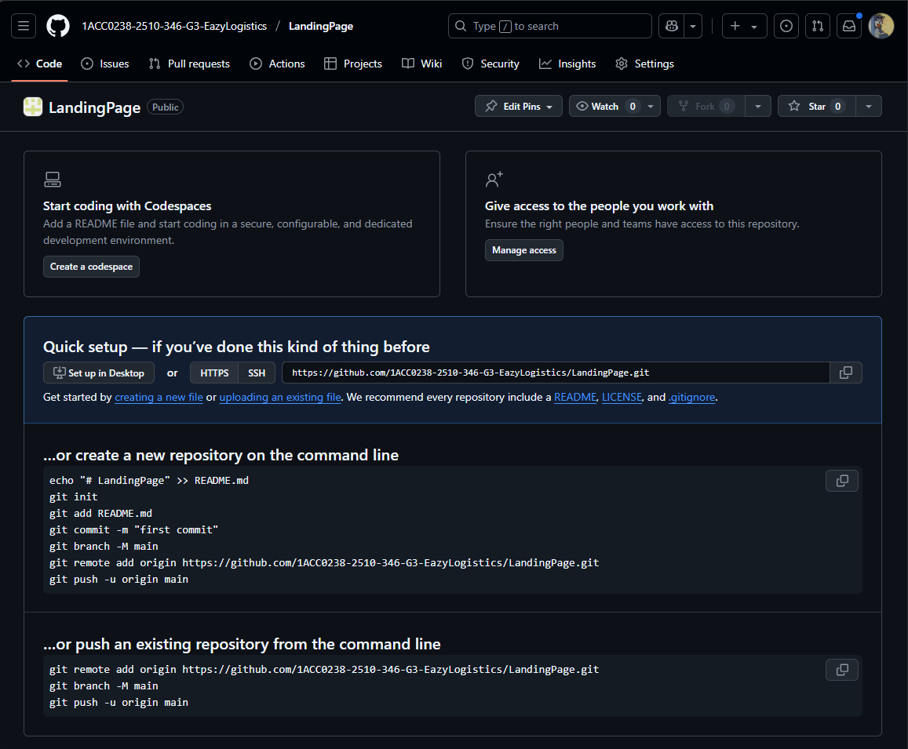
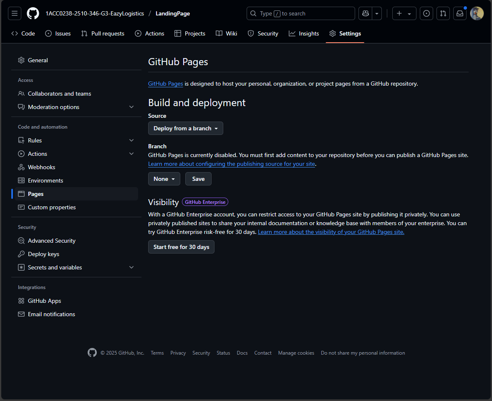
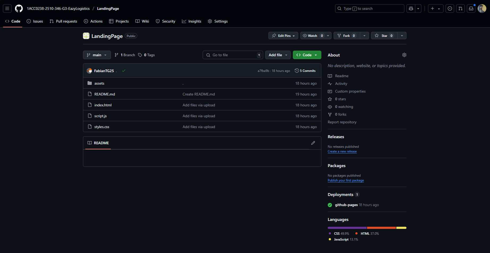
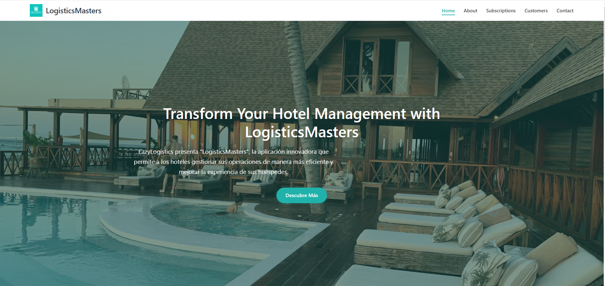

# Capítulo VI: Product Implementation, Validation & Deployment

## 6.1 Software Configuration Management

Esta sección aborda de manera detallada la gestión de configuración del software, un componente clave en el desarrollo y mantenimiento de cualquier sistema tecnológico. Su propósito principal es asegurar la integridad y trazabilidad de todos los artefactos producidos a lo largo del ciclo de vida del software, permitiendo que el equipo de desarrollo pueda trabajar de manera coordinada y estructurada. A través de políticas claras de versionado, control de cambios, definición de entornos y procedimientos estandarizados, se garantiza que cada integrante tenga acceso a configuraciones consistentes y actualizadas. Además, se establecen mecanismos para documentar y validar las modificaciones realizadas, lo que reduce significativamente la posibilidad de errores o incompatibilidades en las etapas de integración y despliegue.

La correcta implementación de una estrategia de gestión de configuración no solo mejora la calidad del producto final, sino que también optimiza la colaboración entre equipos multidisciplinarios, agiliza la detección de problemas y fortalece la estabilidad del sistema en entornos de producción.

### 6.1.1 Software Development Environment Configuration

En esta sub-sección se describe la configuración técnica del entorno de desarrollo utilizado durante el proyecto. Se especifican las herramientas de software instaladas, sus versiones, rutas de acceso y cualquier dependencia necesaria para asegurar un entorno de trabajo homogéneo para todos los miembros del equipo. Esta documentación resulta esencial para prevenir discrepancias durante la ejecución de tareas, evitar conflictos entre versiones y facilitar la incorporación de nuevos integrantes al proyecto.

Asimismo, se detallan las configuraciones iniciales requeridas para compilar, ejecutar y probar el sistema, incluyendo ajustes en IDEs, variables de entorno, gestores de paquetes, y posibles contenedores o entornos virtualizados (como Docker). Este enfoque garantiza que el entorno de desarrollo se mantenga alineado con el entorno de producción, contribuyendo a una transición fluida entre etapas de desarrollo, pruebas y despliegue.

- **Visual Studio Code**: Editor de código utilizado para desarrollar la Landing Page. Su entorno ligero, personalizable y con soporte para múltiples lenguajes facilitó la colaboración entre desarrolladores y la implementación ágil de componentes web.

  

- **HTML5**: Lenguaje de marcado base para estructurar el contenido de la Landing Page. Permitió organizar la información de forma semántica y accesible, mejorando la navegación y la experiencia del usuario.

  

- **CSS3**: Utilizado para aplicar estilos visuales a la Landing Page. Ayudó a mantener una identidad gráfica coherente, responsiva y atractiva, lo cual es clave para captar la atención del usuario final.

  

- **JavaScript**: Lenguaje que permitió incorporar lógica e interactividad a la Landing Page, como animaciones, validaciones y mejoras en la experiencia dinámica del usuario.

  

- **GitHub**: Plataforma de control de versiones que centralizó el código del proyecto. Facilitó el trabajo colaborativo del equipo, permitió el seguimiento de cambios y mejoró la trazabilidad del desarrollo.

  

- **LucidChart**: Herramienta usada para crear diagramas de flujo, wireflows y modelos conceptuales. Contribuyó a la claridad en el diseño funcional y ayudó a definir la lógica de interacción entre pantallas y procesos.

  

- **Figma**: Plataforma de diseño colaborativo utilizada para la creación de wireframes y prototipos visuales de alta fidelidad. Permitió validar la interfaz gráfica con antelación y alinear al equipo de desarrollo con la visión de diseño.

  

- **Android Studio**: Entorno de desarrollo para la aplicación móvil. Proporcionó las herramientas necesarias para programar, depurar, probar y empaquetar la app en dispositivos Android.

  

- **Kotlin**: Lenguaje de programación moderno utilizado para desarrollar la aplicación móvil. Su sintaxis clara y concisa mejoró la eficiencia del código y la productividad del equipo, alineándose con las mejores prácticas de desarrollo en Android.

  

- **Trello**: Plataforma de gestión de tareas basada en tableros y tarjetas, utilizada para organizar y hacer seguimiento del progreso del equipo durante el desarrollo del proyecto. Facilitó la planificación de sprints, la asignación de responsabilidades y la visualización del avance en tiempo real, promoviendo una colaboración efectiva y una mejor administración del tiempo.

  

Cada una de estas herramientas fue seleccionada estratégicamente para cumplir con los objetivos del proyecto, asegurando una solución tecnológica robusta, escalable y centrada en la experiencia del usuario.

### 6.1.2 Source Code Management

**Repositorio de la Landing Page:**  
Durante el desarrollo de la Landing Page, utilizamos un repositorio centralizado en GitHub para almacenar y gestionar el código fuente del proyecto. Esto permitió el trabajo colaborativo, el control de versiones y la trazabilidad de cambios en el desarrollo.

**Implementación de GitFlow:**  
Para nuestra estrategia de gestión de versiones con Git, nos basamos en el modelo de ramificación propuesto en el artículo _“A successful Git branching model”_ de Vincent Driessen. Adoptamos el enfoque **GitFlow**, el cual proporciona una estructura clara y organizada para el desarrollo colaborativo, facilitando la integración y el mantenimiento del código.

- **Rama Principal (`main`)**: Contiene la versión estable en producción.  
- **Rama de Desarrollo (`develop`)**: Integra los últimos avances y funcionalidades en desarrollo. Actúa como entorno de integración continua.  
- **Rama de Lanzamiento (`release`)**: Utilizada para preparar una nueva versión del producto, permitiendo ajustes finales antes de su despliegue.  
  - Deriva de: `develop`  
  - Se fusiona con: `develop` y `main`  
- **Rama de Características (`feature`)**: Destinada al desarrollo de nuevas funcionalidades específicas del producto.  
  - Deriva de: `develop`  
  - Se fusiona con: `develop`  
- **Rama de Corrección Rápida (`hotfix`)**: Diseñada para aplicar soluciones urgentes a errores críticos detectados en producción.  
  - Deriva de: `main`  
  - Se fusiona con: `develop` y `main`  
- **Rama de Alcance (`scope`)**: Rama personalizada creada para gestionar desarrollos relacionados con un módulo o funcionalidad específica de gran tamaño o impacto. Su objetivo es permitir el aislamiento de tareas que abarquen múltiples ramas `feature`, mejorando la organización y facilitando su integración progresiva.  
  - Deriva de: `develop`  
  - Puede actuar como contenedor de varias `feature`  
  - Se fusiona con: `develop` o `release`, según el caso

  

  

**Conventional Commits:**  
Para mantener claridad y consistencia en los mensajes de confirmación (`commits`), adoptamos la convención **Conventional Commits**, la cual estandariza la estructura semántica de cada mensaje, permitiendo una mejor comprensión del historial de cambios y una posible automatización en la generación de changelogs.

**Tipos de mensajes utilizados:**

- `feat`: Incorporación de nuevas funcionalidades.
- `fix`: Corrección de errores o bugs.
- `docs`: Cambios relacionados con la documentación.
- `style`: Ajustes de formato sin impacto funcional.
- `refactor`: Reestructuración del código sin alterar su comportamiento.
- `test`: Adición o modificación de pruebas automatizadas.
- `chore`: Tareas de mantenimiento y configuraciones del entorno.
- `perf`: Mejoras orientadas al rendimiento del sistema.
 
### 6.1.3 Source Code Style Guide & Conventions  
### 6.1.4 Software Deployment Configuration  

## 6.2 Landing Page & Mobile Application Implementation
En esta sección se detalla el proceso completo de implementación, pruebas, documentación y despliegue de la Landing Page, los Web Services y las Aplicaciones Móviles. Abarca desde la planificación inicial hasta la entrega final, asegurando que cada componente cumpla con los requisitos establecidos y funcione correctamente.

## 6.2.1 Sprint 1
En esta sección se registra y explica el avance en términos de producto y trabajo colaborativo para el Sprint 1. Durante este sprint, el equipo se enfocará en la implementación de la Landing Page, asegurando que cumpla con los requisitos establecidos y funcione correctamente.

### 6.2.1.1 Sprint Planning 1  
En esta sección se especifican los aspectos principales del Sprint Planning Meeting. Este encuentro es fundamental para definir los objetivos y tareas del Sprint 1, asegurando que todos los miembros del equipo estén alineados y preparados para comenzar el trabajo. A continuación, se presenta un cuadro resumen del Sprint Planning Meeting, que incluye los puntos clave discutidos y las decisiones tomadas.

| **Sprint #**                       | Sprint 1                                                                                                                                                                                                                                                                                                                           | 
|------------------------------------|------------------------------------------------------------------------------------------------------------------------------------------------------------------------------------------------------------------------------------------------------------------------------------------------------------------------------------|
| **Sprint Planning Background**     |                                                                                                                                                                                                                                                                                                                                    |
| Date:                              | 2025/05/10                                                                                                                                                                                                                                                                                                                         |
| Time:                              | 5:00 PM                                                                                                                                                                                                                                                                                                                            |
| Location:                          | Reunión virtual via Discord                                                                                                                                                                                                                                                                                                        |
| Prepared by:                       | Gabriel Braithuaite, Mathias Vasquez                                                                                                                                                                                                                                                                                               |
| Attendees (to planning meeting):   | Gabriel Braithuaite, Mathias Vasquez, Joaquin Pedraza, Jose Luza, Fabian Reyes                                                                                                                                                                                                                                                     |
| Sprint n – 1 Review Summary        | No aplica para Sprint 1                                                                                                                                                                                                                                                                                                            |
| Sprint n – 1 Retrospective Summary | No aplica para Sprint 1                                                                                                                                                                                                                                                                                                            |
| **Sprint Goal & User Stories**     |                                                                                                                                                                                                                                                                                                                                    | 
| Sprint 1 Goal                      | **Our focus is** on developing and implementing a functional and attractive Landing Page.   **We believe it delivers** a positive first impression and attracts potential users to explore more about our product.   **This will be confirmed when** the Landing Page is deployed and receives positive feedback from users. |
| Sprint 1 Velocity                  | Para este sprint 1, el equipo de EazyLogistics puede aceptar 18 Story Points, los cuales son abarcados en las User Stories de la primera EPIC.                                                                                                                                                                                     |
| Sum of Story Points                | 18                                                                                                                                                                                                                                                                                                                                 |

### 6.2.1.2 Sprint Backlog 1  
En esta sección se presenta el Sprint Backlog del Sprint 1, que incluye las tareas y actividades planificadas para el desarrollo de la Landing Page. Cada tarea está asociada a una User Story específica, lo que permite al equipo realizar un seguimiento del progreso y asegurarse de que se cumplan los objetivos del sprint.

Screenshot del Sprint Backlog del Sprint 1 en Trello: https://trello.com/b/xzXIrtZu/eazylogistics

| **Sprint #** | Sprint 1                                     |                |                                                                               |                                                                                                                                                                                                    |                       |              |        |
|--------------|----------------------------------------------|----------------|-------------------------------------------------------------------------------|----------------------------------------------------------------------------------------------------------------------------------------------------------------------------------------------------|-----------------------|--------------|--------|
| User Story   |                                              | Work Item/Task |                                                                               |                                                                                                                                                                                                    |                       |              |        |
| Id           | Title                                        | Id             | Title                                                                         | Description                                                                                                                                                                                        | Estimation (Hours) | Assined To   | Status |
| US001        | Acceso a la sección de Resumen	              | WI001          | Implementación de acceso a la sección de Resumen                              | Desarrollar y configurar la sección de información de la página de resumen para que los visitantes puedan acceder fácilmente y obtener información clara sobre la aplicación.                      | 1 hora                | Fabian Reyes | Done   |
| US002        | Acceso a la sección de Características	      | WI002          | Implementación de acceso a la sección de Características                      | Desarrollar y configurar la página de "Características" para que los visitantes puedan acceder fácilmente y enterarse de las características claves de la aplicación.                              | 1 hora                | Fabian Reyes | Done   | 
| US003        | Envío de Correos a los CEO de Easylogistics  | WI003          | Implementación de envío de correos a los CEO de Easylogistics                 | Desarrollar y configurar la funcionalidad que permita a los visitantes enviar correos con información adicional sobre las funcionalidades de la aplicación a los CEO de Easylogistics.             | 1 hora                | Fabian Reyes | Done   |
| US004        | Registro de Nuevos Usuarios                  | WI004          | Implementación de registro de nuevos usuarios                                 | Desarrollar y configurar la funcionalidad que permita a los visitantes registrarse como usuarios para ponerse en contacto y utilizar la aplicación.                                                | 1 hora                | Fabian Reyes | Done   |
| US005        | Información de Funcionalidades               | WI005          | Implementación de la sección de Información de Funcionalidades                | Desarrollar y configurar un sector en la página que detalle todas las funcionalidades que ofrece la aplicación.                                                                                    | 1 hora                | Fabian Reyes | Done   |
| US006        | Sector de Planes Disponibles                 | WI006          | Implementación del sector de Planes Disponibles                               | Desarrollar y configurar un sector en la página que muestre los diferentes planes que ofrece la aplicación, permitiendo a los visitantes escoger el que mejor se adapte a sus necesidades.         | 1 hora                | Fabian Reyes | Done   |
| US007        | Sector de Preguntas Frecuentes               | WI007          | Implementación del sector de Preguntas Frecuentes                             | Desarrollar y configurar un sector en la página que permita a los visitantes acceder a preguntas frecuentes y obtener respuestas rápidas a dudas comunes.                                          | 1 hora                | Fabian Reyes | Done   |
| US008        | 	Conexión de Easylogistics con la Aplicación | WI008          | Implementación de la sección de Conexión de Easylogistics con LogisticsMaster | Desarrollar y configurar una sección en la página que explique cómo Easylogistics está conectado con la aplicación, proporcionando a los visitantes una comprensión clara de su propósito y origen | 1 hora                | Fabian Reyes | Done   |

### 6.2.1.3 Development Evidence for Sprint Review  
En esta sección se explican y presentan los avances en la implementación de los productos de la solución según el alcance del Sprint 1. Durante este sprint, el equipo se ha enfocado en la creación y despliegue de la Landing Page

| Repository             | Branch | Commit Id | Commit Message                    | Commit Message Body                                                     | Commited on (Date) |
|------------------------|--------|-----------|-----------------------------------|-------------------------------------------------------------------------|--------------------|
| FabianTG25/LandingPage | main   |           | Implementación de la Landing Page | Se implementó la Landing Page con todas las funcionalidades requeridas. | 2025/05/14         |

Enlace al repositorio: https://github.com/1ACC0238-2510-346-G3-EazyLogistics/LandingPage

### 6.2.1.4 Testing Suite Evidence for Sprint Review  
Para este sprint, no se han realizado pruebas automatizadas, ya que el equipo ha decidido enfocarse en la implementación de la Landing Page y no se han desarrollado pruebas unitarias o de integración. Sin embargo, se han realizado pruebas manuales para asegurar que la Landing Page funcione correctamente y cumpla con los requisitos establecidos.
Se podrían implementar pruebas automatizadas utilizando herramientas como Selenium en futuros sprints, pero por el momento, el equipo ha optado por realizar pruebas manuales para asegurar la calidad del producto.

### 6.2.1.5 Execution Evidence for Sprint Review  
En este Sprint 1, el equipo ha desarrollado y desplegado la Landing Page, asegurando que cumpla con los requisitos establecidos y funcione correctamente. A continuación, se presentan las evidencias de ejecución del Sprint 1, que incluyen capturas de pantalla y descripciones de las funcionalidades implementadas.

### 6.2.1.6 Services Documentation Evidence for Sprint Review  
Este sprint 1 tuvo como enfoque principal la implementación de la Landing Page, por lo que no se han desarrollado Web Services. La documentación de Endpoints con OpenAPI y los detalles relacionados con Web Services serán relevantes en sprints futuros cuando se aborde la implementación y documentación de estos servicios. 

### 6.2.1.7 Software Deployment Evidence for Sprint Review  
En este Sprint 1, el equipo ha desplegado la Landing Page utilizando github pages. A continuación, se presentan las evidencias de despliegue del Sprint 1, que incluyen capturas de pantalla y pasos detallados del proceso de despliegue.
1. **Creación del Repositorio**: Se creó un repositorio en GitHub para alojar el código de la Landing Page. El repositorio se llama "LandingPage" y está disponible en la cuenta de GitHub del equipo.
  
  url del repositorio: https://github.com/1ACC0238-2510-346-G3-EazyLogistics/LandingPage

2. **Configuración de GitHub Pages**: Se habilitó la opción de GitHub Pages en la configuración del repositorio. Esto permite que el contenido del repositorio se publique como una página web estática.
  

3. **Despliegue de la Landing Page**: Se subió el código HTML y CSS de la Landing Page al repositorio. GitHub Pages generó automáticamente una URL para acceder a la página.
  

4. **Acceso a la Landing Page**: La Landing Page se puede acceder a través de la URL proporcionada por GitHub Pages. Esta URL es pública y permite que cualquier persona acceda a la página.
  
  url de la landing page: https://1acc0238-2510-346-g3-eazylogistics.github.io/LandingPage/

### 6.2.1.8 Team Collaboration Insights during Sprint  
Para el desarrollo de este sprint, el equipo se dividió las actividades de implementación de la Landing Page, asegurando que cada miembro del equipo se encargara de una parte específica del proyecto.

GitHub insights:

## 6.3 Validation Interviews  
### 6.3.1 Diseño de Entrevistas  
### 6.3.2 Registro de Entrevistas  
### 6.3.3 Evaluaciones según heurísticas  

## 6.4 Video About-the-Product
